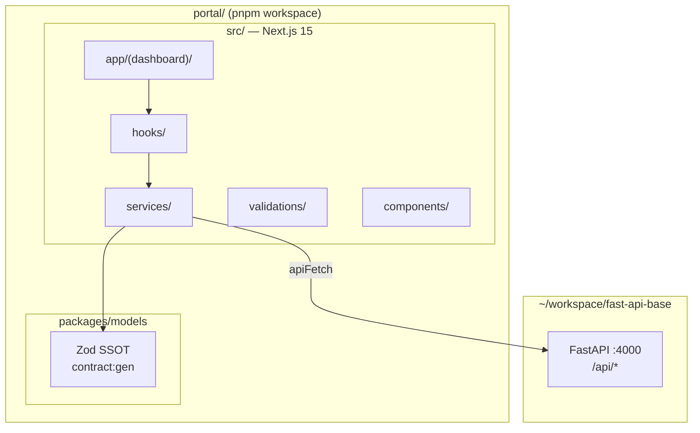
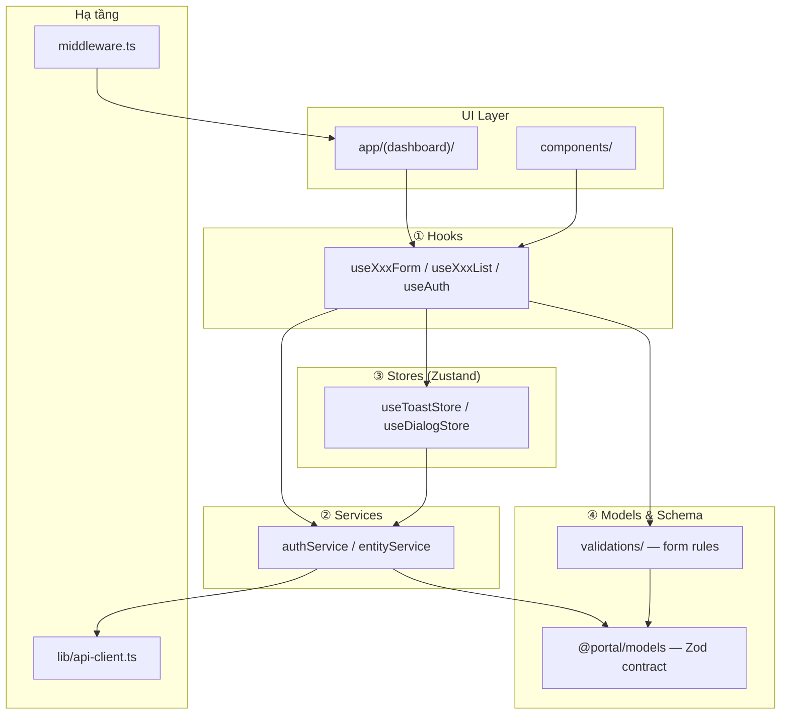

# Kiến trúc — Portal monorepo (Next.js 15 + FastAPI)

Tài liệu mô tả:

1. **Monorepo** — `src/` (Next.js) + `packages/models`
2. **FE 4 tầng** — Hooks → Services → Stores → Models/Schema
3. **BE** — FastAPI tại `~/workspace/fast-api-base` (repo riêng, port `:4000`)

> **Kết luận nhanh:** FE trong `src` với **4 tầng đầy đủ**. Contracts Zod nằm `@portal/models` (`packages/models`). Backend Factory AI = **fast-api-base** (không còn Nest in-repo làm target mới).

---

## 0. Monorepo (2026)



| Thành phần | Path | Doc |
|------------|------|-----|
| Next app | `src` (`app/`, `hooks/`, `services/`, …) | Phần 1–5 bên dưới |
| Shared contracts | `packages/models` (`@portal/models`) | [CONTRACT-FIELD-REGISTRY](./CONTRACT-FIELD-REGISTRY.md) |
| **FastAPI (target)** | `~/workspace/fast-api-base` | [factory-ai-stack](./factory-ai-stack.md) · [REPO-SPLIT-MAP](./REPO-SPLIT-MAP.md) |
| Codegen FE | `portal:gen` → `src` | [PORTAL-CODEGEN](./PORTAL-CODEGEN.md) |
| Codegen BE | `fast-gen` (fast-api-base) | fast `FAST-CODEGEN.md` |
| Wire FE↔BE | `/wire` | [WIRE-PHASE-DIAGRAM](./WIRE-PHASE-DIAGRAM.md) |

Chi tiết workspace: [MONOREPO-STRATEGY](../dev-environment/MONOREPO-STRATEGY.md).

**Import FE:** `@/` → `src` · models → `@portal/models`.

**Env wire:** `NEXT_PUBLIC_API_URL=http://127.0.0.1:4000` → `apiFetch('/health')` = `GET /api/health` trên fast-api-base.

---

## 1. Chuẩn mục tiêu FE (4 tầng)



### Vai trò từng tầng

| Tầng | Thư mục | Trách nhiệm | Không làm |
|------|---------|-------------|-----------|
| **Hooks** | `src/hooks/` | Orchestration UI: form, list state, auth | Gọi `apiFetch` trực tiếp |
| **Services** | `src/services/` | HTTP: endpoint, parse response | Giữ Zustand state |
| **Stores** | `src/stores/` | Toast, dialog, ephemeral UI state | Logic HTTP chi tiết |
| **Models** | `@portal/models` + `validations/` | API contract + form rules | Render UI |

### Quy tắc import

```
app/ + components/
  → hooks/
      → stores
      → services → @portal/models → apiFetch
  → validations/
```

**Cấm ngược chiều:** `@portal/models` không import stores/services/hooks.

---

## 2. Hiện trạng `src/`

```
src/
├── app/(auth)/login/
├── app/(dashboard)/
├── hooks/                     # useAuth, useDataTable, portal:gen hooks
├── services/                  # auth.service, *.service
├── stores/                    # toast, dialog
├── validations/
├── components/ui|molecules|organisms/
├── lib/api-client.ts
└── middleware.ts              # cookie auth_token
```

**Auth:** `/login/` public · dashboard protected · `createAuthService()` + `parseSchemaOrThrow`.

---

## 3. Luồng mẫu: Login

```tsx
// LoginCard → useAuth().login()
// → createAuthService().login()
// → apiFetch('/auth/login')
// → parseSchemaOrThrow(LoginResponseSchema, res.data)
```

---

## 4. Thêm feature (codegen)

```bash
pnpm contract:gen --spec …/ir/spec.yaml
pnpm portal:gen --spec …/ir/spec.yaml
```

Output: `app/(dashboard)/{route}/page.tsx`, `hooks/`, `services/`, `mocks/`.

---

## 5. Lệnh & tài liệu

```bash
pnpm dev
pnpm build
pnpm test:unit
pnpm ui:add button
```

- [PORTAL-CODEGEN](./PORTAL-CODEGEN.md) · [E2E-TESTIDS](./E2E-TESTIDS.md) · [MONOREPO-STRATEGY](../dev-environment/MONOREPO-STRATEGY.md)
