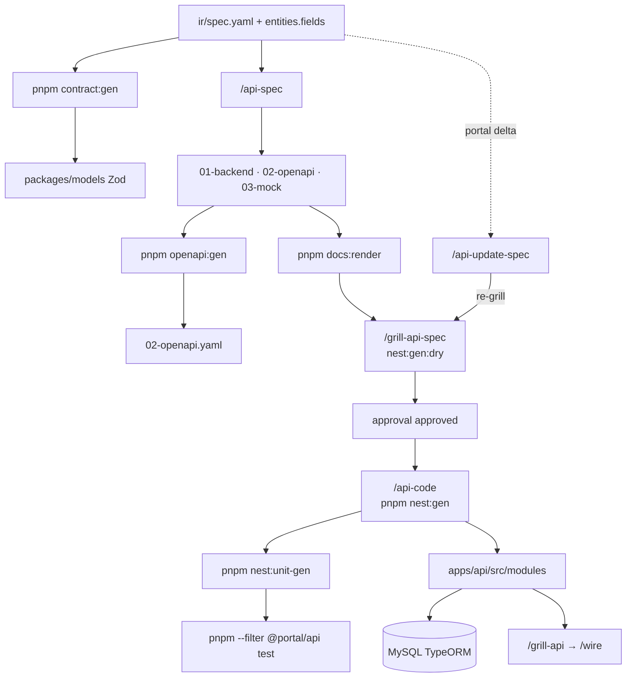

# Team AI Backend Workflow (Nest — in-repo)

Progressive disclosure: **một session = một command**.  
API code: `apps/api/` · Contracts: `packages/models/` · Spec: `docs/features/yaml/.../ir/`

Session mới: đọc `.harness/progress.md` trước khi tiếp tục cùng feature slug.

---

## Flow diagram



---

## Command router (`/api`)

| State | Command |
|-------|---------|
| Chưa có contract Zod | `pnpm contract:gen` sau dev-grill fill `entities.fields` |
| Chưa có `01-backend-spec` | `/api-spec` |
| Portal delta | `/api-update-spec` |
| Chưa codegen-ready | `/grill-api-spec` |
| `approval` approved | `/api-code` → `pnpm nest:gen` |

---

## Scripts (repo root)

| Lệnh | Mục đích |
|------|----------|
| `pnpm contract:registry` | Validate `registries/contract-field.registry.json` |
| `pnpm contract:gen:dry --spec .../ir/spec.yaml` | Plan Zod + relationships.meta |
| `pnpm contract:gen --spec .../ir/spec.yaml` | Write `@portal/models` |
| `pnpm openapi:gen --spec .../backend/01-backend-spec.yaml` | Write `02-openapi.yaml` |
| `pnpm nest:registry` | Validate `registries/nest-codegen.registry.json` |
| `pnpm nest:gen:dry --spec ...` | Plan Nest CQRS scaffold |
| `pnpm nest:gen --spec ...` | Write `apps/api` + manifest |
| `pnpm nest:unit-gen --spec ...` | Jest handler specs |
| `pnpm --filter @portal/api test` | Run API unit tests |
| `pnpm dev:api` | Nest dev :4000 (TypeORM + MySQL) |

---

## Artifact paths (backend docs)

Feature backend contract (mirror layout cũ `api/docs/features`):

```text
docs/features/yaml/{role}/{domain}/{function}/
  ir/spec.yaml              # FE + entities.fields SSOT
  backend/
    01-backend-spec.yaml    # /api-spec output
    02-openapi.yaml
    03-mock-data.yaml
  generated/
    contract.manifest.json
    codegen.manifest.json   # nest:gen
    HANDOFF.md
```

Template: `docs/templates/backend-api.yaml`

---

## Skills

| Command | Skill |
|---------|-------|
| `/contract` | `contract/SKILL.md` |
| `/api-spec` | `api-spec/SKILL.md` (port) |
| `/grill-api-spec` | `grill-api-spec/SKILL.md` |
| `/api-code` | `api-code/SKILL.md` |
| `/api-update-spec` | `api-update-spec/SKILL.md` |
| `/api` | `api/SKILL.md` router |
| nest patterns | `nest-base/SKILL.md` |

Extracts: `.cursor/extracts/nest/` (PR sau)

---

## Liên kết

- [CONTRACT-FIELD-REGISTRY](./CONTRACT-FIELD-REGISTRY.md)
- [BACKEND-CODEGEN](./BACKEND-CODEGEN.md)
- [NEST-UNIT-PHASE-DIAGRAM](./NEST-UNIT-PHASE-DIAGRAM.md)
- [BACKEND-API-QUICKSTART](./BACKEND-API-QUICKSTART.md)
- [NEST-API-STRUCTURE](./NEST-API-STRUCTURE.md)
- [BACKEND-PHASE-DIAGRAM](./BACKEND-PHASE-DIAGRAM.md)
- [WIRE-PHASE-DIAGRAM](./WIRE-PHASE-DIAGRAM.md)
- [FEATURE-ARTIFACT-COMMANDS](./FEATURE-ARTIFACT-COMMANDS.md)

Legacy Laravel `~/workspace/api` — read-only reference khi port pattern; không phải runtime mặc định.
