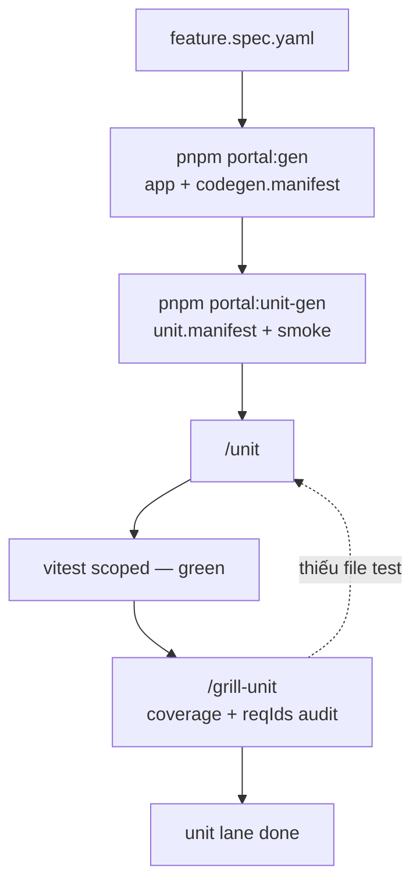
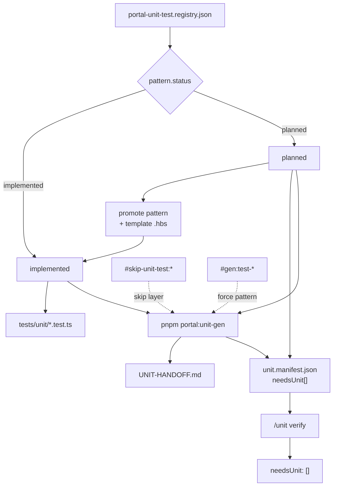

# Unit phase — Dev lane (Vitest)

> **Dev-only** — lane Vitest logic, **độc lập** Phase 2 E2E (`/test`).  
> **Không** nằm [FULL-CYCLE-PIPELINE-DIAGRAM](./FULL-CYCLE-PIPELINE-DIAGRAM).  
> Hub codegen: [PORTAL-CODEGEN](./PORTAL-CODEGEN.md) · Skills: `/unit` · `/grill-unit`

---

## Unit lane (flow chính)

Chỉ luồng dev Vitest — **không** gộp tag lifecycle, **không** loop grill ↔ unit săn 100%.



| Bước | Ai | Việc |
|------|-----|------|
| `portal:gen` | script | App layers + `codegen.manifest.json` |
| `portal:unit-gen` | script | Smoke từ registry → `unit.manifest.json`, `UNIT-HANDOFF.md` |
| **`/unit`** | dev + AI | `needsUnit` clear, vitest **green** scoped |
| **`/grill-unit`** | dev + AI | Coverage + `reqIds` trên scope feature — **audit**, không regen smoke |

**`/grill-unit` không loop** đến khi 100%: pass → done; gap coverage → bảng đề xuất; **chỉ** quay `/unit` khi thiếu **file** test (không tự `portal:unit-gen` hàng loạt).

E2E (`/test`) — pipeline khác, không thay unit lane.

**Song song:** API Jest lane — [NEST-UNIT-PHASE-DIAGRAM](./NEST-UNIT-PHASE-DIAGRAM.md) (backend, độc lập file này).

---

## `#needs-unit-test` — tag lifecycle

Theo `unitgen/runners/` + `registries/unit-test.registry.json` (diagram riêng).



| Tag / field | Nghĩa |
|-------------|--------|
| `needsUnit[]` | Registry debt — pattern `planned` hoặc `when` chưa gen được |
| `#needs-unit-test:{layer}:{target}` | Mirror trong HANDOFF; clear khi pattern `implemented` + gen green |
| `#skip-unit-test:{layer}` | Bỏ pattern layer khỏi plan |
| `#gen:test-*` | Force gen pattern (vd schema, wire) |
| Base phase | Promote registry — **không** hand-write backlog vô hạn |

Chi tiết promote & grill default: [UNIT-REGISTRY-PROMOTION](./UNIT-REGISTRY-PROMOTION.md) · [PORTAL-UNIT-GEN-ROADMAP](./PORTAL-UNIT-GEN-ROADMAP.md).

---

## Đọc gì / không đọc gì (`/unit`)

| Đọc | Không đọc |
|-----|-----------|
| `unit.manifest.json`, `UNIT-HANDOFF.md` | `src/app/`, `components/` |
| `codegen.manifest` `files[]` (logic layers) | inventory `tests/unit/` |
| spec `requirements` filter `reqIds` manifest | E2E testcase YAML |
| source 1 file / gap | `portal-design.registry` |

---

## 1 source logic → 1 file test

| Source | Test (`tests/unit/…`) |
|--------|------------------------|
| `models/{entity}/*.schema.ts` | `models/{entity}/*.schema.test.ts` |
| `validations/{entity}/schemas.ts` | `validations/{entity}/schemas.test.ts` |
| `services/{entity}.service.ts` | `*.service.test.ts` + `*.create` / `*.export` / `*.wire` khi có method |
| `hooks/…/use*List.ts` | `tests/unit/hooks/…/use*List.test.ts` |
| `hooks/…/use*Form.ts` | `tests/unit/hooks/…/use*Form.test.ts` |

`commonBaselines` trong registry — **không** gen lại per feature.

---

## Lệnh mẫu

```bash
pnpm portal:unit-gen --spec docs/features/admin/hotel/hotel-list.spec.yaml
pnpm portal:unit-gen --spec … --phase wire --force

pnpm exec vitest run tests/unit/models/admin-hotel/
pnpm exec vitest run tests/unit/models/admin-hotel/ --coverage
```

---

## Liên kết

| Doc | Mục đích |
|-----|----------|
| [PORTAL-CODEGEN](./PORTAL-CODEGEN.md) | `portal:gen` + `portal:unit-gen` hub |
| [BACKEND-CODEGEN](./BACKEND-CODEGEN.md) | `contract:gen` + `nest:gen` + `nest:unit-gen` hub |
| [NEST-UNIT-PHASE-DIAGRAM](./NEST-UNIT-PHASE-DIAGRAM.md) | Jest lane chi tiết |
| [UNIT-REGISTRY-PROMOTION](./UNIT-REGISTRY-PROMOTION.md) | `#gen:test-*` · `#needs-unit-test` promote |
| [PORTAL-UNIT-GEN-ROADMAP](./PORTAL-UNIT-GEN-ROADMAP.md) | Patterns & PR roadmap |
| `.cursor/extracts/portal-unit-workflow.md` | Checklist token-thin cho AI |
| `.cursor/skills/unit/SKILL.md` | `/unit` |
| `.cursor/skills/grill-unit/SKILL.md` | `/grill-unit` |
