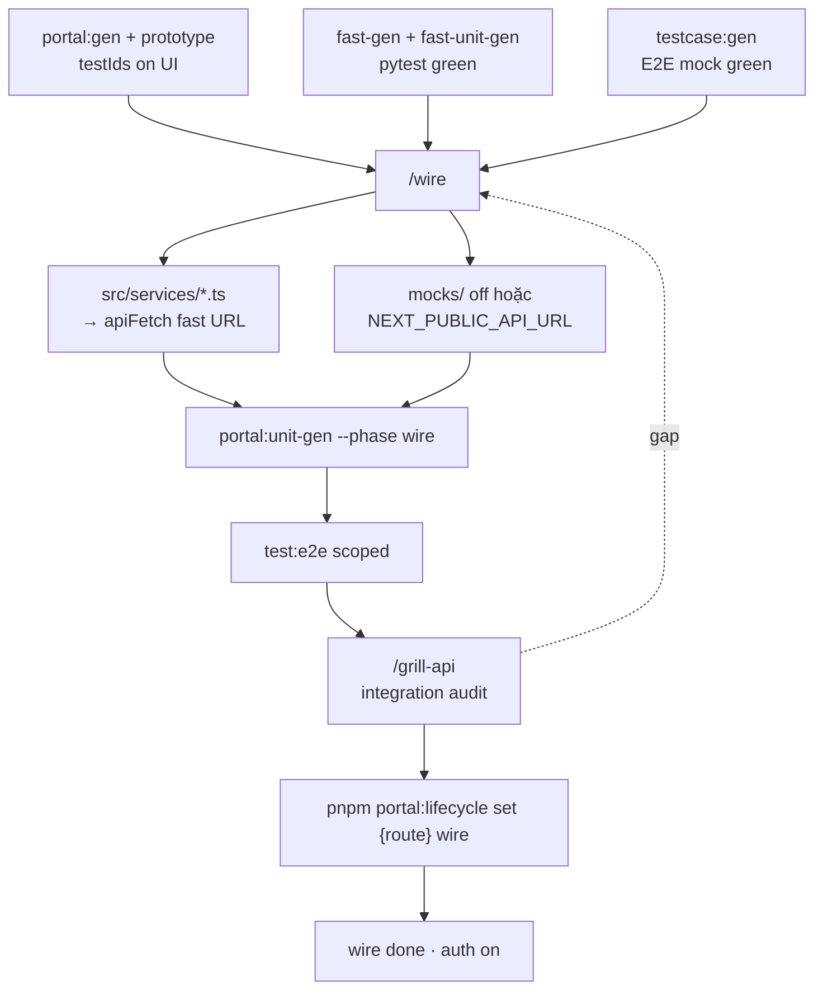
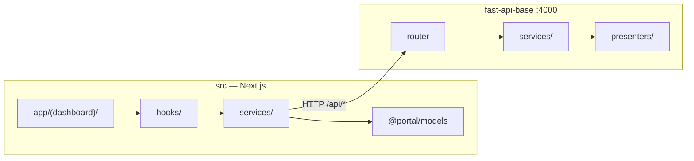
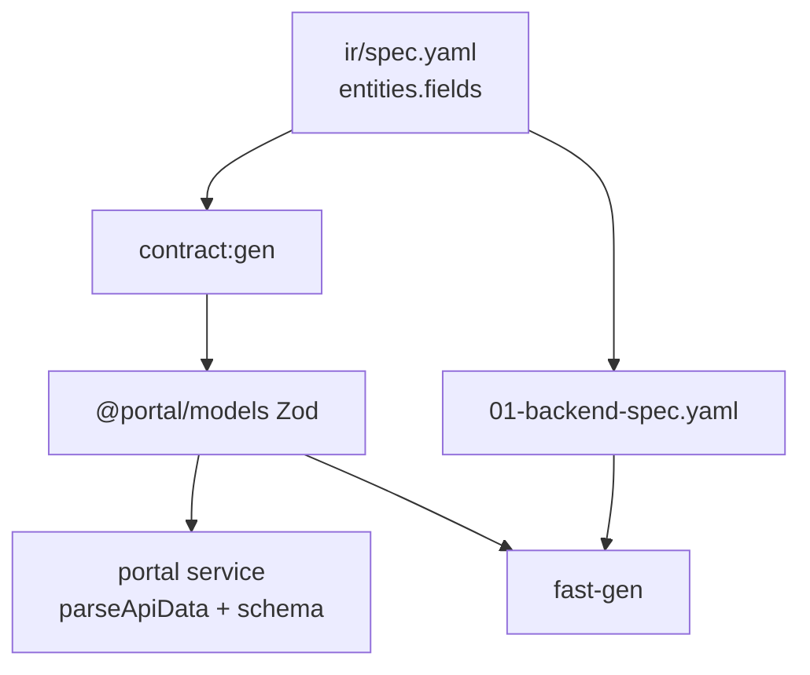
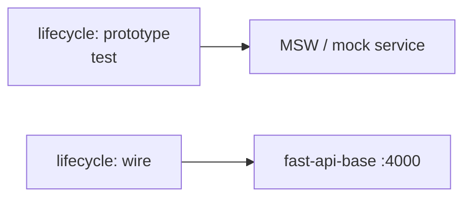

# Wire phase — FE ↔ FastAPI integration

> **Phase 3 Wire** — [FULL-CYCLE-PIPELINE-DIAGRAM](./FULL-CYCLE-PIPELINE-DIAGRAM).  
> Prerequisite API: **fast-api-base** `~/workspace/fast-api-base` · [factory-ai-stack](./factory-ai-stack.md).  
> Prerequisite FE: [PORTAL-CODEGEN](./PORTAL-CODEGEN.md) · E2E mock lane: [TEST-PHASE-DIAGRAM](./TEST-PHASE-DIAGRAM.md)

Wire = chuyển feature từ **mock API / MSW** sang **FastAPI thật** (`fast-api-base :4000`), đồng bộ contract `@portal/models`, bật auth lifecycle `wire`.

---

## Wire cycle (flow chính)



| Bước | Ai | Việc |
|------|-----|------|
| Prerequisites | dev | FE scaffold + fast module + E2E mock pass |
| **`/wire`** | dev + AI | Map `api.endpoints` → `services/` gọi `/api/...` fast |
| **Env** | dev | `NEXT_PUBLIC_API_URL=http://127.0.0.1:4000` |
| **`portal:unit-gen --phase wire`** | script | Service tests mock real response shape |
| **`pnpm test:e2e`** | dev | Playwright against integrated stack |
| **`/grill-api`** | dev + AI | Contract keys FE↔BE, error envelope, pagination |
| **Lifecycle `wire`** | dev | `pnpm portal:lifecycle set /route wire` — auth bật ([PAGE-LIFECYCLE](./PAGE-LIFECYCLE.md)) |

---

## Kiến trúc runtime (wire)



Chi tiết 4 tầng FE + monorepo: [ARCHITECTURE](./ARCHITECTURE.md).

---

## Contract alignment (không rename keys)



Quy tắc: cùng key nested shape FE↔BE — [CONTRACT-FIELD-REGISTRY](./CONTRACT-FIELD-REGISTRY.md) · rule `portal-contract-naming`.

---

## E2E modes (prototype / test / wire)



Spec `#wire-only` trong testcase → giữ mock hoặc skip đến khi lifecycle `wire` — [TEST-PHASE-DIAGRAM](./TEST-PHASE-DIAGRAM.md).

---

## Lệnh mẫu

```bash
# FastAPI (repo riêng)
cd ~/workspace/fast-api-base
PYTHONPATH=src .venv/bin/uvicorn app.main:app --reload --port 4000 --app-dir src

# Next
cd ~/workspace/portal && pnpm dev

# E2E integrated (fast phải chạy trước)
pnpm test:e2e tests/e2e/factory/knowledge-hub.spec.ts
```

---

## Gap loop

Sai contract hoặc endpoint → [UPDATE-SPEC-FLOW](./UPDATE-SPEC-FLOW.md) · `deferTo: wire` → [TECH-DEBT-FLOW](./TECH-DEBT-FLOW.md).

Portal-only delta → `/update-spec` · Backend delta → `/fast-spec` → `/grill-fast-spec`.

---

## Liên kết

| Doc | Nội dung |
|-----|----------|
| [factory-ai-stack](./factory-ai-stack.md) | 4-repo stack |
| [UNIT-PHASE-DIAGRAM](./UNIT-PHASE-DIAGRAM.md) | Vitest `--phase wire` |
| [TEST-PHASE-DIAGRAM](./TEST-PHASE-DIAGRAM.md) | E2E sau wire |
| [PAGE-LIFECYCLE](./PAGE-LIFECYCLE.md) | Stage `wire` + auth |
